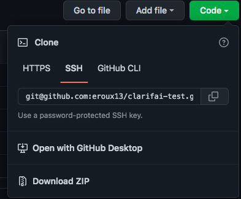
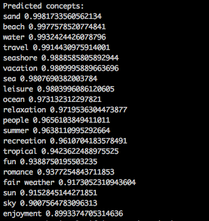

# ClarifAI API Test

## Description

This application allows a user to be able to scan an image using a URL and be able to return a response that includes what is found in the image and the probability rate/accuracy of that image.

Documentation: https://docs.clarifai.com/

## Table of Contents

- [Description](#description)
- [License](#license)
- [Installation](#installation)
- [Usage](#usage)
- [Contributors](#contributors)
- [Tests](#tests)
- [Questions](#questions)

## License

License chosen: MIT.
More information about the license chosen can be found on [Open Source Initiative](https://opensource.org/licenses/MIT).

## Installation

To install this project, a user first needs to clone the repo onto their local machine.

Next they need to navigate into the project folder thourgh either terminal or git bash, depending on the users OS, and run `npm i` to install all the dependencies. Then the user can start up the applicaiton by running `node index.js`.

## Usage

The purpose for this repo is to test and demonstrate the usage for image recognition using ClarifAI API.

## Contributors

[eroux13](https://www.github.com/eroux13)

## Tests

## Questions

Feel free to follow my GitHub [profile](https://www.github.com/eroux13).
If you have any questions about this project, please reach out to me via ej.roux13@gmail.com.
